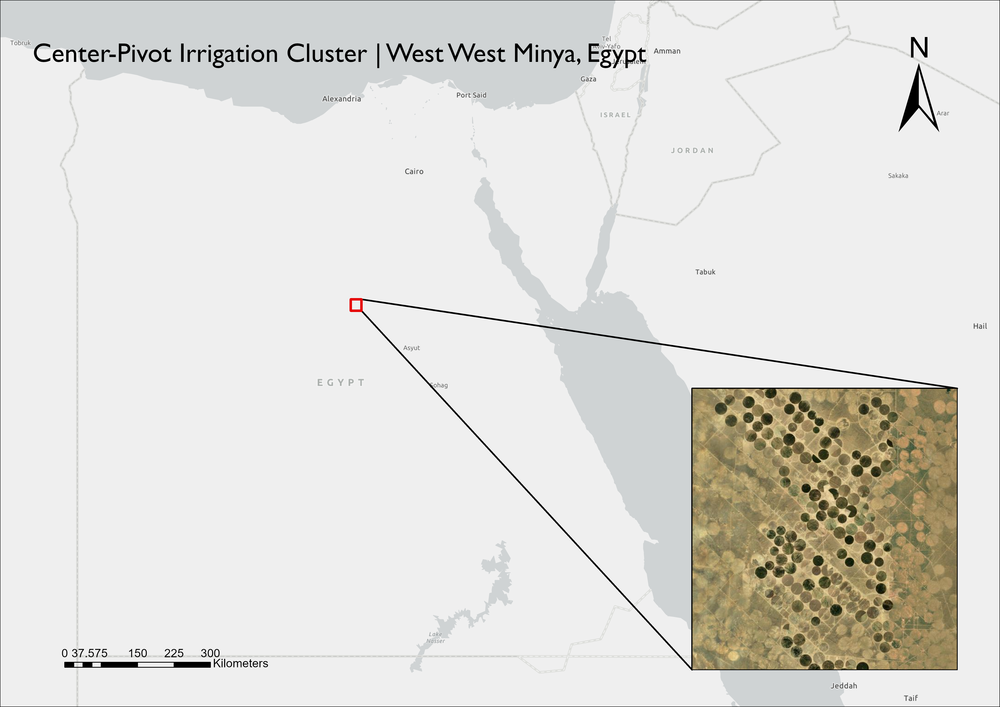
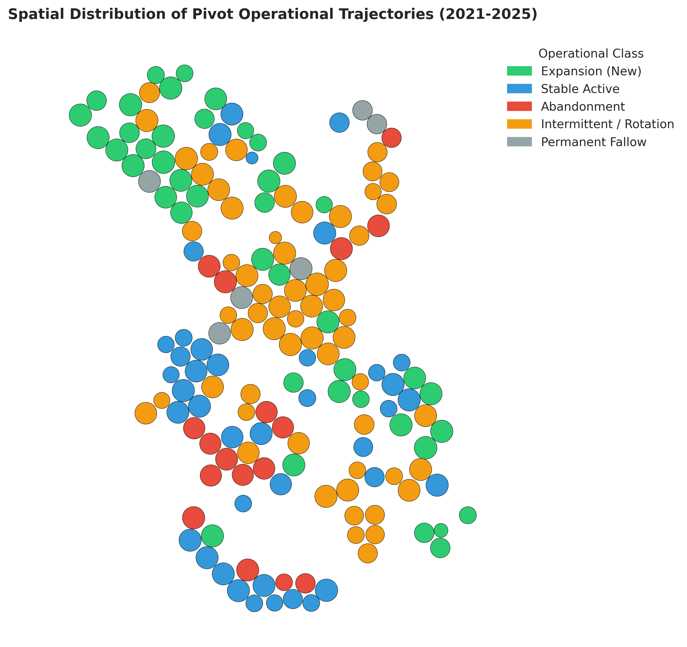
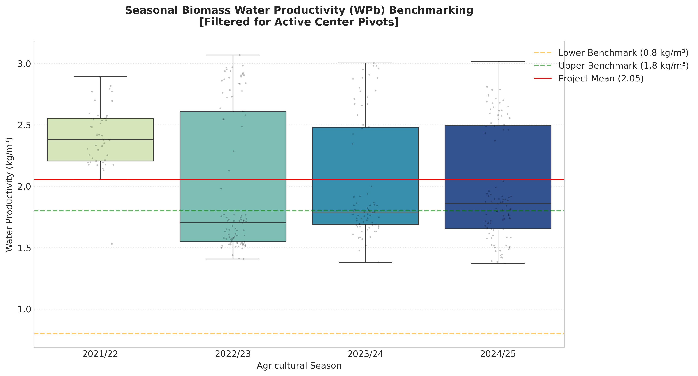
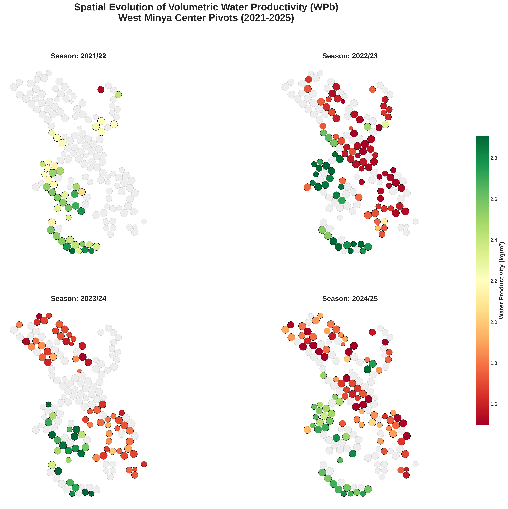
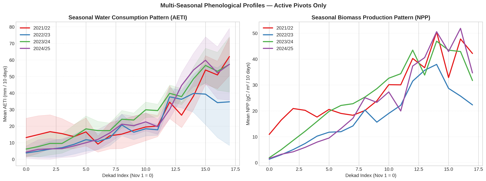

# West West Minya Irrigation Monitoring

### Satellite-Based Water Productivity Analysis of 166 Center-Pivot Systems
### West Minya Governorate, Egypt · 2021–2025

---

## Study Area

*West West Minya reclamation zone, West Minya Governorate, Egypt.
166 center-pivot irrigation systems mapped from Sentinel-2 satellite imagery.
The cluster relies entirely on the non-renewable Nubian Sandstone Aquifer.
Basemap: Esri World Imagery.*

---

## What This Project Does

This project uses open satellite data to monitor 166 center-pivot irrigation systems
across four consecutive winter seasons (November–April, 2021–2025). It answers three
questions that matter to water resource managers and agricultural investors:

- **How fast is the irrigated area expanding** — and which fields are new, stable, or abandoned?
- **How much groundwater is being extracted** — season by season, in measurable volumes?
- **How efficiently are crops converting water into biomass** — and is that efficiency improving?

---

## Key Numbers

| What | Value |
|---|---|
| Pivots monitored | 166 |
| Irrigated area — Season 1 (2021/22) | 2,531 ha |
| Irrigated area — Season 4 (2024/25) | 5,359 ha |
| **Total growth** | **+111.7% in four seasons** |
| New pivots detected | 43 |
| Peak groundwater demand | **28.3 MCM** (2024/25) |
| Mean water productivity | **2.054 kg dry matter / m³ water** |
| Pivots with improving efficiency | **82.5%** of active units |

---

## How Each Pivot Was Classified

Every pivot received one operational label based on four years of satellite observation.

*Each circle is one center-pivot, positioned at its true location and colored
by what it did over the four monitored seasons. Expansion fronts concentrate
in the northwest. Operational instability clusters in the central zone.*

| Class | Pivots | Share | What it means |
|---|---|---|---|
| Intermittent / Rotation | 60 | 36.1% | Active in 1–2 seasons with no clear pattern |
| Expansion (New) | 43 | 25.9% | Inactive in 2021–2023, active from 2023 onward |
| Stable Active | 40 | 24.1% | Consistently cultivated — 3 or more seasons |
| Abandonment | 17 | 10.2% | Active in 2021/22, no longer active by 2024/25 |
| Permanent Fallow | 6 | 3.6% | No activity detected across all four seasons |

> Classifications describe what was observed between November 2021 and
> April 2025 only. A pivot labelled "Expansion (New)" may have operated
> before the monitoring period.

---

## Water Productivity — How Efficient Are These Fields?

Water productivity (WPb) measures how many kilograms of dry plant matter
are produced per cubic meter of water consumed. Higher means more efficient.

The FAO WaPOR reference range for irrigated agriculture in arid environments
is **0.8–1.8 kg/m³**. The West West Minya cluster performs above this range
on average.

*Each box shows the spread of water productivity across all active pivots
in that season. Dashed lines mark the FAO reference range. Not a single
pivot-season fell below the lower benchmark.*

**Why did productivity appear to drop in 2022/23?**

It was not a real drop — it was a dilution effect. Active pivot count doubled
from 45 to 97 in that season. The 52 newly commissioned fields performed at
lower efficiency in their first season, which is normal and expected for newly
reclaimed land. By 2023/24 the cluster had largely recovered. This is a
management signal, not a failure signal.

> No crop-type field data was available. Results assume a winter cereal-dominant
> system (wheat or barley), consistent with the November–April growing calendar
> and observed phenological patterns.

---

## Where Are the Most and Least Efficient Fields?

*Each panel shows one season. Active pivots are colored from red (lower
efficiency) to green (higher efficiency). Inactive pivots are shown in grey.
The same color scale applies to all four panels for direct comparison.*

Two clear patterns emerge:
1. High-efficiency zones are geographically stable across all four seasons,
   suggesting real differences in soil quality or management experience
   within the cluster — not random variation.
2. The cluster visibly expands season by season, with more colored circles
   appearing in the outer zones by 2024/25.

---

## Within-Season Water and Biomass Patterns

*Left panel: water consumption per 10-day period across the November–April
season (AETI). Right panel: biomass production per 10-day period (NPP).
Each line is one season. Shaded areas show variability between pivots.*

What the curves tell us:

- Water consumption rises steadily through the season, peaking in
  **March–April** as crops reach full canopy and temperatures increase.
- Biomass production peaks at **March–mid April** — consistent with the
  grain-fill and maturation stage of winter cereals in Upper Egypt
  (Steduto et al., 2012).
- The 2021/22 season starts 30 days later than all other years. This likely
  reflects mid-season monitoring onset rather than a late planting year.
  Seasonal totals for 2021/22 are therefore not directly comparable to later
  seasons.
- From 2022/23 onward, all three seasons follow nearly identical curve shapes,
  confirming a stable and consistent crop calendar.

---

## Groundwater Demand — Aquifer Pressure Over Time

| Season | Active Area | Groundwater Extracted |
|---|---|---|
| 2021/22 | 2,531 ha | 13.5 MCM |
| 2022/23 | 5,145 ha | 22.0 MCM |
| 2023/24 | 4,142 ha | 24.4 MCM |
| 2024/25 | 5,359 ha | 28.3 MCM |

Demand grew by **110%** over four seasons — driven almost entirely by
area expansion, not by increased water use per field. Mean water consumption
per active pivot remained relatively stable.

The Nubian Sandstone Aquifer underlying this zone is a fossil resource that
receives virtually no modern recharge (Gossel et al., 2004). The growth
trajectory documented here is a direct and measurable signal of increasing
aquifer stress.

---

## Methodology

| Step | What was done | Tool |
|---|---|---|
| Pivot mapping | 166 circular fields digitized from satellite imagery | ArcGIS Pro 3.4 |
| Activity classification | Fields classified active or inactive per season | Sentinel-2 SAVI median ≥ 0.3 |
| Sentinel-2 access | Seasonal median composites built from all valid acquisitions | AWS Element84 STAC — lazy loading |
| Data extraction | AETI, NPP, PCP extracted per pivot per season | rasterstats · −20m negative buffer |
| PCP alignment | WaPOR PCP L1 (~5km) resampled to 20m AETI grid | rioxarray |
| Water productivity | Dry matter biomass ÷ water consumed | WaPOR L3 · carbon fraction 0.45 |
| Demand estimation | Net irrigation need → gross aquifer abstraction | FAO-56 · center-pivot η = 0.85 |
| Trend analysis | Rate of WPb change per pivot over four seasons | Mann-Kendall · Sen's Slope |
| Classification | Five operational classes from four-season activity patterns | Python |

**Satellite data sources:**

| Source | Product | Native Resolution | Used for |
|---|---|---|---|
| FAO WaPOR v3 | L3-AETI-D | 20m / 10-day | Actual water consumption |
| FAO WaPOR v3 | L3-NPP-D | 20m / 10-day | Biomass production |
| FAO WaPOR | PCP Level 1 | ~5km → aligned to 20m | Precipitation input |
| Sentinel-2 L2A | Band 4 + Band 8 | 10m | SAVI activity classification |

---

## Repository Contents

├── notebook/          Full analysis — one self-contained notebook

├── data/              Six CSV files with all results

├── figures/           Five key figures at 300 DPI

├── docs/              Full reference list

└── requirements.txt   Python environment specification

---
## References

Full formatted list with DOIs: [`docs/references.md`](docs/references.md)

- Allen et al. (1998) — FAO Irrigation and Drainage Paper 56
- FAO (2023) — WaPOR Database Methodology v3
- Gossel et al. (2004) — Nubian Aquifer · *Hydrogeology Journal*
- Huete (1988) — SAVI · *Remote Sensing of Environment*
- IHE Delft (2020) — Water Productivity using WaPOR
- Mann (1945) — *Econometrica* · Sen (1968) — *JASA*
- Steduto et al. (2012) — FAO Irrigation and Drainage Paper 66
- Zwart & Bastiaanssen (2004) — *Agricultural Water Management*

---

## License & Use

This work is licensed under
[Creative Commons Attribution-NonCommercial 4.0 International (CC BY-NC 4.0)](https://creativecommons.org/licenses/by-nc/4.0/).

**You may** share and adapt this work for educational and research purposes,
provided you credit the author.

**You may not** use this work or any part of its methodology for commercial,
industrial, or for-profit purposes without explicit written permission.

For commercial licensing or consulting inquiries, contact the author via LinkedIn https://www.linkedin.com/in/nour-ibrahim/.

---

*Author: Nour Negm · PhD | Plant Genetics & Breeding | Remote Sensing & Data Analytics for Agriculture & Water · Egypt · 2026*

